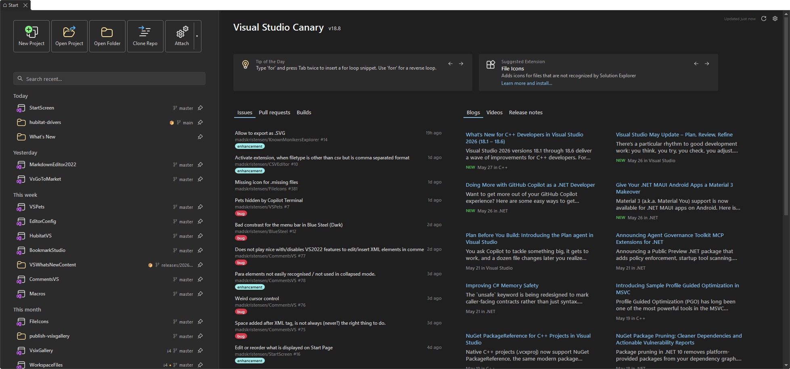
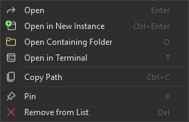
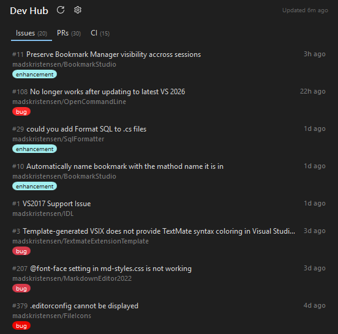
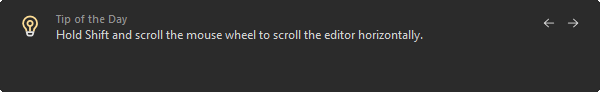
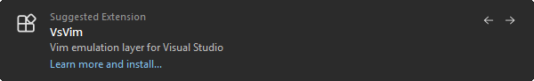

[marketplace]: <https://marketplace.visualstudio.com/items?itemName=MadsKristensen.StartScreen>
[vsixgallery]: <https://www.vsixgallery.com/extension/StartScreen.2d76ac3d-7ff2-47e1-82d8-e507cf765bbe>
[repo]: <https://github.com/madskristensen/StartScreen>

# Start Screen for Visual Studio

[](https://github.com/madskristensen/StartScreen/actions/workflows/build.yaml)
[](https://github.com/sponsors/madskristensen)

Download this extension from the [Visual Studio Marketplace][marketplace]
or get the latest CI build from [Open VSIX Gallery][vsixgallery].

----------------------------------------------

**Your first five seconds in Visual Studio should feel *fast*.** Start Screen
replaces the default launch experience with a clean, modern dashboard that
gets you into code immediately - no clicking through menus, no waiting.



## Get to work in one click

Open a recent solution, create a new project, open a project or folder,
clone a repo, or attach and reattach to a process - all from a single,
focused screen. The action bar puts every common workflow front and center
so you never have to dig through File or Debug menus again.

## Your recent projects, supercharged

Start Screen doesn't just list your recent files. It understands how you
work:

**Find anything instantly.** Type a few characters and the search filter
narrows your list in real time. Pin the projects you care about most so
they always float to the top.

**See your Git status at a glance.** Every repo shows its current branch,
ahead/behind counts, uncommitted changes, and the last commit time - all
loaded in the background so the UI stays snappy. Hover for the full
picture, or spot a detached HEAD before you accidentally commit to nowhere.

**Stay organized.** Projects are grouped by when you last touched them -
*Today*, *This week*, *This month* - so yesterday's prototype doesn't bury
this morning's deadline.

**Right-click for power moves.** Open the containing folder, launch a
terminal, pull the latest Git changes, copy the path, pin, unpin, or
remove - all from a context menu with keyboard shortcuts.



## Developer news, built right in

A curated feed of engineering news from the Visual Studio Blog, .NET Blog,
and more lives right next to your project list. It refreshes in the
background and caches locally, so it's always ready and never slows you
down.

Want different sources? Drop your own RSS or Atom feeds into a simple JSON
file and Start Screen picks them up automatically - no restart needed.

```txt
%USERPROFILE%\.vs\StartScreen\newsfeeds.json
```

```json
{
  "name": "My Custom Feed",
  "url": "https://example.com/feed.xml",
  "enabled": true
}
```

Full JSON schema validation is included so you get IntelliSense while
editing.

## YouTube video feed

The latest videos from the Visual Studio YouTube channel are shown
alongside the news feed. Each video displays a thumbnail, title, and
publish date - videos published in the last three days get a "NEW"
badge so you never miss fresh content.

The feed is cached locally and refreshes automatically every four hours.
Click the refresh button next to the header to force an update at any
time.

## Drag and drop

Drop a solution, project, or folder from File Explorer directly onto the
Start Screen to open it. You can also drag pinned items to reorder them -
a visual indicator shows exactly where the item will land.

## Dev Hub

The Dev Hub panel shows your open pull requests, assigned issues, and
recent CI runs from GitHub and Azure DevOps - right next to your project
list. Data loads in the background and is cached locally so the UI stays
responsive.



### Custom search query (GitHub)

By default the Dev Hub shows issues and PRs that "involve" your GitHub
account. Click the gear icon next to the Dev Hub header to enter a custom
GitHub search query. The extension prepends `is:issue` or `is:pr`
automatically, so you only need to provide the filtering part.

Use the `{login}` placeholder to reference the authenticated username.

**Example - show open issues across multiple orgs:**

```text
state:open archived:false sort:updated-desc user:madskristensen org:VsixCommunity org:ligershark
```

**Example - only issues assigned to you:**

```text
state:open assignee:{login}
```

**Example - issues in a single org:**

```text
state:open org:dotnet
```

Leave the field empty to restore the default behavior (`involves:{login}`).

The custom query applies to the Issues and Pull Requests tabs. The CI
Runs tab always fetches from your recently pushed repositories and is not
affected by the query.

> The custom search query setting only applies to GitHub. Azure DevOps
> uses dedicated REST APIs for each repository and is not affected.

## Tip of the day

Every time Visual Studio starts, a short productivity tip appears at the
bottom of the Start Screen. The tips rotate daily and cover navigation
shortcuts, editing tricks, refactoring commands, and other features you
might not know about. No configuration required - just glance down and
learn something new.



Have a tip to share? [Open an issue][repo] with your suggestion or submit
a pull request directly to
[tips.txt](https://github.com/madskristensen/StartScreen/blob/master/src/Resources/tips.txt).

## Suggested extensions

Right next to the Tip of the Day, Start Screen showcases a curated
extension from the Visual Studio Marketplace. The suggestion rotates
daily and highlights free, open-source extensions that enhance your
development workflow.



Extensions you've already installed show an "Installed" badge.
Extensions you haven't tried yet display an "Install" link that takes
you straight to the Marketplace page.

Want to suggest an extension? Submit a pull request to
[extensions.json](https://github.com/madskristensen/StartScreen/blob/master/src/Resources/extensions.json).
We're looking for extensions that are:

- Free
- Open source (with a GitHub repository link)
- Support both ARM and x86 architectures
- Compatible with Visual Studio 2022+

## Keyboard-first design

Every part of Start Screen is navigable without a mouse.

Open the Start Screen any time from **File > Start Screen** or press
**Ctrl+Shift+Alt+Backspace**.

### Recent solutions / folders

| Shortcut   | Action                 |
| ---------- | ---------------------- |
| Up / Down  | Move between items     |
| Enter      | Open                   |
| Ctrl+Enter | Open in new instance   |
| O          | Open containing folder |
| T          | Open in terminal       |
| G          | Git pull               |
| Ctrl+C     | Copy path              |
| P          | Pin / Unpin            |
| Del        | Remove from list       |
| Alt+`      | Focus search box       |
| Right      | Jump to Dev Hub        |

### Dev Hub

| Shortcut  | Action               |
| --------- | -------------------- |
| Up / Down | Move between items   |
| Enter     | Open in browser      |
| Ctrl+C    | Copy URL             |
| Left      | Jump to recent files |
| Right     | Jump to news feed    |

### News feed

| Shortcut            | Action                 |
| ------------------- | ---------------------- |
| Up / Down           | Move between rows      |
| Left / Right        | Move between columns   |
| Enter               | Open in browser        |
| Ctrl+C              | Copy URL               |
| Left (first column) | Jump to Dev Hub        |
| Right (last column) | Jump to YouTube videos |

### YouTube videos

| Shortcut  | Action             |
| --------- | ------------------ |
| Up / Down | Move between items |
| Enter     | Open in browser    |
| Ctrl+C    | Copy URL           |
| Left      | Jump to news feed  |

### Action bar

| Shortcut     | Action                     |
| ------------ | -------------------------- |
| Left / Right | Move between buttons       |
| Down         | Move focus to recent files |

## Looks right at home

Start Screen inherits your Visual Studio theme - Light, Dark, Blue, or
whatever you're running. No jarring color mismatches, no extra
configuration. It just blends in.

## Install it

1. Grab it from the [Visual Studio Marketplace][marketplace].
2. Restart Visual Studio.
3. That's it. Start Screen is already waiting for you.

It works out of the box. Feed preferences and pinned items are persisted
automatically.

## Get involved

Found a bug? Have an idea? Head to the [issue tracker][repo] - pull
requests are always welcome.
